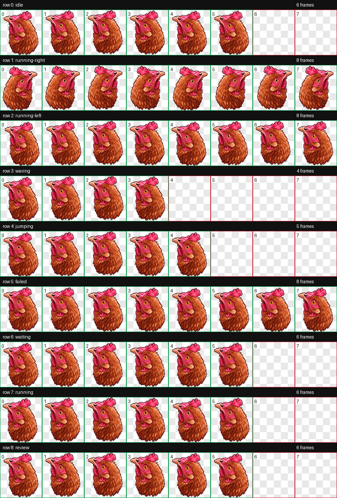

# Golova, dai deneg

An animated Codex pet: a pixel-art chicken head that shows up for the job and, when the task is done, asks for its share.



## The story

**“Голова, дай денег”** means **“Head, give me money.”** It is a playful phrase from the long-running *Head* meme in Russian anonymous-imageboard culture. This pet turns that running joke into a task-completion companion: finish the work, and the Head immediately asks for money.

This particular version was inspired by the [archived 2021 Head thread on 2ch.life](https://2ch.life/b/arch/2021-10-06/res/255649283.html), then rebuilt from a chicken-head reference as a large, readable pixel sprite for Codex.

## What is included

- `spritesheet.webp` — the transparent 8 × 9 animated sprite atlas (192 × 208 px cells).
- `pet.json` — the Codex custom-pet manifest.
- `scripts/golova-notify` — an optional macOS completion notification.
- `preview.png` — a contact sheet of all animation frames.

## Install in Codex

Copy the package into your local Codex pets directory:

```sh
mkdir -p "$HOME/.codex/pets/golova-dai-deneg"
cp pet.json spritesheet.webp "$HOME/.codex/pets/golova-dai-deneg/"
```

Then open Codex Settings, refresh the pet list if necessary, and select **Голова**.

### Optional: task-completion reminder

The script displays a macOS notification reading “Голова, дай денег” when a Codex task ends.

```sh
chmod +x scripts/golova-notify
```

Add its absolute path to the `notify` array in `~/.codex/config.toml`, for example:

```toml
notify = ["/absolute/path/to/golova-dai-deneg/scripts/golova-notify"]
```

## Notes

The original reference photo is not included in this repository. This is a small fan-made meme pet with no promise of financial gain.
